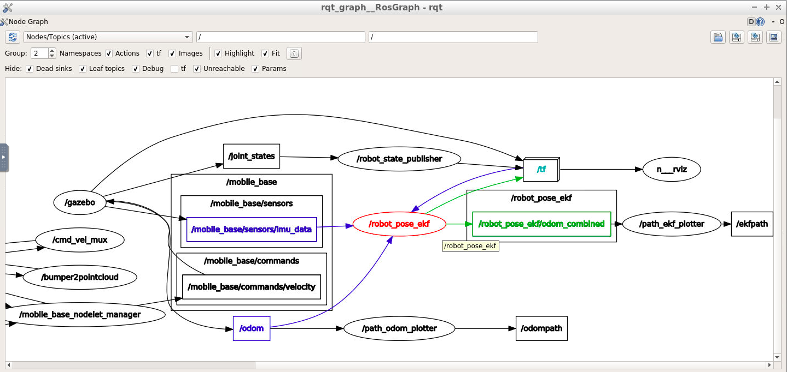
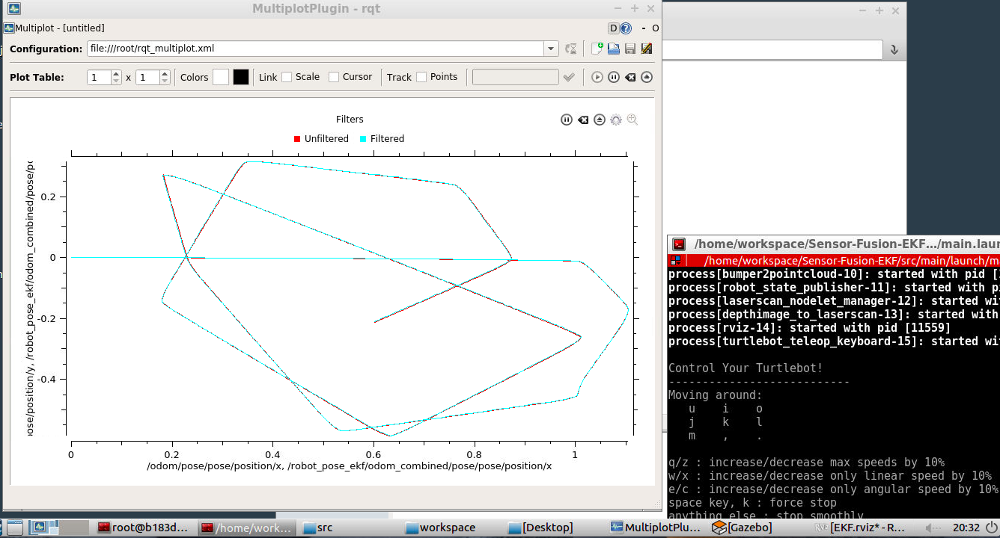
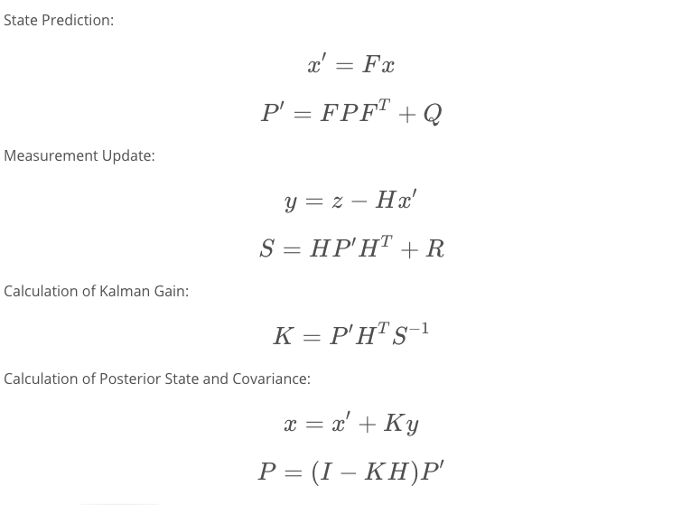
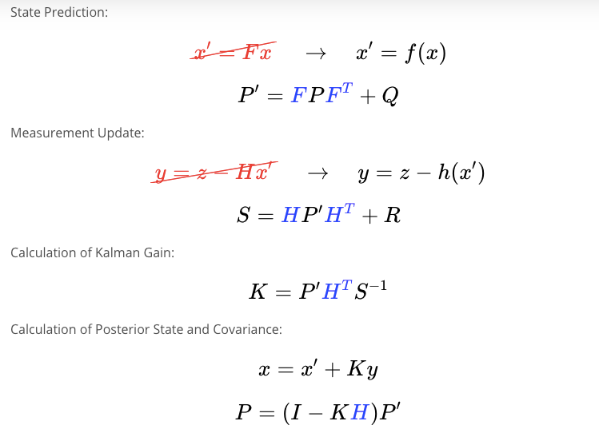

# Sensor Fusion using EKF
This repository include an example application of Extended Kalman Filter using  ```robot_pose_ekf```  ROS package on gazebo turtle bot simulation package using its IMU and wheel odometry data

## Directory Structure
```sh
.
├── README.md
└── src
    ├── CMakeLists.txt -> /opt/ros/kinetic/share/catkin/cmake/toplevel.cmake
    ├── EKF.rviz
    ├── RvizLaunch.launch
    ├── main
    │   ├── CMakeLists.txt
    │   ├── launch
    │   │   └── main.launch
    │   └── package.xml
    ├── odom_to_trajectory
    │   ├── CMakeLists.txt
    │   ├── Images
    │   │   └── Output.png
    │   ├── LICENSE
    │   ├── README.md
    │   ├── launch
    │   │   └── create_trajectory.launch
    │   ├── package.xml
    │   └── scripts
    │       ├── path_ekf_plotter.py
    │       └── path_odom_plotter.py
    ├── robot_pose_ekf
    │   ├── 3-Clause_BSD_license
    │   ├── CHANGELOG.rst
    │   ├── CMakeLists.txt
    │   ├── Images
    │   │   └── Output.png
    │   ├── README.md
    │   ├── example_with_gps.launch
    │   ├── package.xml
    │   ├── plotekf.m
    │   ├── robot_pose_ekf.launch
    │   ├── scripts
    │   │   └── wtf.py
    │   ├── src
    │   │   ├── nonlinearanalyticconditionalgaussianodo.cpp
    │   │   ├── odom_estimation.cpp
    │   │   └── odom_estimation_node.cpp
    │   └── srv
    │       └── GetStatus.srv
    ├── turtlebot
    │   ├── LICENSE
    │   ├── README.md
    │   ├── setup_create.sh
    │   ├── setup_kobuki.sh
    │   ├── turtlebot
    │   ├── turtlebot.rosinstall
    │   ├── turtlebot_bringup
    │   ├── turtlebot_capabilities
    │   ├── turtlebot_capabilities.rosinstall
    │   ├── turtlebot_description
    │   └── turtlebot_teleop
    └── turtlebot_simulator
        ├── README.md
        ├── turtlebot_gazebo
        ├── turtlebot_simulator
        ├── turtlebot_simulator.rosinstall
        ├── turtlebot_stage
        └── turtlebot_stdr
```

## Steps to launch the simulation

Clone the repo:
```sh
$ git clone https://github.com/farzingkh/Sensor-Fusion-EKF.git
```

Build and setup:
```sh
$ catkin_make
$ source devel/setup.bash
```
Launch the simulation
```sh
$ roslaunch main main.launch
```

## Output

Graph of nodes and topics.



Plot of filtered and unfiltered path: difference is small until the robot skids or hits an obstacel then wheel encoders might no show accurate data as the wheels might have slipped.  To see that use th ekeyboard and drive the robot until it hits and obstacel while you are still driving it and then yuo can see the difference between filtered and unfiltered plots.



# Kalman Filter

One way of looking at Kalman filter is to consider it as any other type of filter: designed to eliminate or reduce noise from signal. In the case of Kalman filter, its goal is to  reduce or eliminate uncertainty and noise from the data regarding the states of a system. Kalman filter accepts a noisy measurement from sensors and assumes that the signals have Gaussian ditribution, and therefore, they can be described by their means and variance. This assumption is the main basis for Kalman filters. It also accepts inital guess about the states of the system, and then, it uses system models (State Transition Function in State Space modelling) to predict the next values for states of the system. Later, it updates the states based on the next observations of the states obtained from measured values by sensors. In general, Kalman Ffilter can be described by two steps of measurement update and prediction. Following equations are used for calculations of each step:



# Extended Kalman Filter

Since Kalman filter is based on the assumption that sensor data can be modelled using Gaussian distribution, in which case if the system is nonlinear, transformation of sensor data model using nonlinear system model and measurement matrix will result in non-Gaussian distribution in predicted states. In this case a linearization of the state transition and measurement function can be used for prediction of covariance matrices which is the basis of Extended Kalman Filters (EKF). Mean values can still be predicted by nonlinear functions. Following equations are used for calculations of predication and measurement update steps:



Where H and F are Jacobian of nonlinear f and h functions.